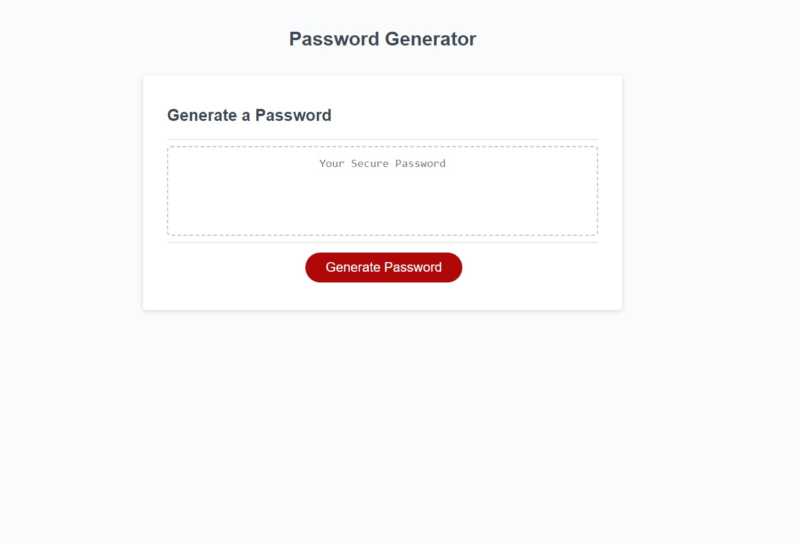

# password-generator

## Description

This is a password generator. It was built with some starter code, HTML, CSS, and JavaScript.

It will:

- accept user input about the desired length (between 8 and 128 characters) of the random password
- have the user decide if they want numbers, symbols, lowercase letters, or uppercase letters in their password
- return two separate alerts if the user decides to generate a password outside these specifications
- provide the user with a random password

Through making the password generator I:

- gained experience with JavaScript "prompt", "confirm", and "alert"
- used "addEventListener" to connect an HTML element with JavaScript
- wrote a set of "if statements" to fill an empty array
- created a "for loop" to select the random password

---

## Installation

This password generator can be [viewed online](https://scott-j-clarke.github.io/password-generator/).

---

## Usage

Look at the password generator through Chrome "developer tools" to learn how the HTML and JavaScript are connected. 

---

## Credits

Thank you to Amber, Paige, Kiara, and Bret for helping me sort this out in our study group!

Thank you to James Quick for making the video [Build a Password Generator Function with Vanilla JavaScript (Advent of JS Challenge)](https://www.youtube.com/watch?v=O-79Cb5s9U4&ab_channel=JamesQQuick). 

---

## License

MIT

---

## Screenshot

---